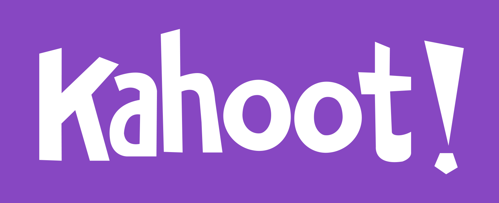
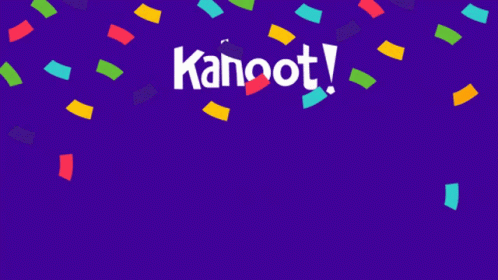

# Backend 2 - Kahoot API




## Overview

In this assignment we will augment our frontend knowledge of creating beutiful websites by learning how to design backends, the designs that provide your sites with data and handle complex logic. You will build a replica of the API for the quiz website [Kahoot](https://kahoot.com/). The assignment will help you practice more complex database and API design techniques and help you learn how to test a backend without using a frontend.

<!-- Perhaps some video of the final product could go here -->

## Setup

### Database (Mongo)

First, you need to install mongodb, the database client for this API.

On OSX something like this should work:

```bash
brew uninstall --force mongodb
brew tap mongodb/brew
brew install mongodb-community
```

### Pull Starter

Now, go ahead and pull the backend starterpack that contains the pacakges and boilerplate needed for a express and mongo backend.

We're going to be building an API, where users can make requests to create or respond to quizzes. We will be using [a backend starterpack](https://github.com/dartmouth-cs52/express-babel-starter) to start, which sets us up with an `express` node server with a tiny bit of boilerplate as well as linting and babel. You could easily recreate this, but for now we'll save you some time by providing it for you.

🚀 This is similar to cloning a repo with `git clone`, but with a key difference. Instead of cloning from one remote location, we will add a new "remote" (basically a reference to a repo hosted on Github) so that we can pull code from there but also retain the reference to our repo for this project. That way, we don't modify the starterpack when we want to push our changes to Github.

```bash
# make sure you are in your project directory
git remote add starter https://github.com/dartmouth-cs52/express-babel-starter
git pull starter main
```
You may have to add the `--allow-unrelated-histories` flag to the `git pull` command if you get an error about the histories not being related. 

Then run these following commands in your project directory to start our new node+express app in dev reloading mode.

```bash
npm install
npm start
```

## Intro Express

[Express](https://expressjs.com/) is a **server side** web framework for Node.js.  What it does for us is provide a way to listen for and respond to incoming web requests. Today, we will be creating API endpoints to respond to certain CRUD-style requests.

Recall that the `src/server.js` file is the entry point for our API. Note how we are setting the route:

```javascript
// default index route
app.get('/', (req, res) => {
  res.send('hi');
});
```

The 2nd parameter to `.get()` is a function that takes 2 arguments: `request` and `response`.

`request` is an express object that contains, among other things, any data that was part of the request. For instance, the JSON parameters we would POST or PUT in our asynchronous `axios` calls would be available as `req.body.parameterName`.

`response` is another special express object that contains, among other things, a method named `send` that allows us a send back a response to the client.  When your API call gets back JSON data this is how it is returned.  Consider `res.send()` the equivalent of a network based `return` statement. This is important. You can only have **1** `res.send()`. Note that it is good practice to `return res.send()` unless you intend to run code after sending the response.

We'll add more routing in shortly, but first let's set up our database!

## Mongo Database Server

We will need a database to store the information aboout the kahoot quizzes and the responses from players. For this version of the assignment, we will be using the non-relational [MongoDB](https://www.mongodb.com/) as our database. We've already installed `mongodb` using Homebrew.

<!-- In assignment ~~NNN~~, you will replicate the API with [PostgreSQL](https://www.postgresql.org/), a relational database. -->

 🚀 You may need to run the `brew services start mongodb-community` process, which your node app will connect to.  This is a background server process. 

Recall you can interface with your database from the commandline using the mongo shell with the command `mongo`.  You can also play around with a more graphical client [mongodb compass community](https://www.mongodb.com/download-center?jmp=nav#compass) (just make sure to download the *community* version).

## Mongoose

<!-- {: .small .fancy } -->

To interface with mongo for our API, we will use a module called `mongoose`. [Mongoose](http://mongoosejs.com/) is a an object model for mongo. This allows us to treat data that we are storing in mongo as objects that have a nice API for querying, saving, validating, etc. rather than writing Mongo queries directly. Mongo is in general considered a schema-less store.  We store JSON documents in a large object tree similarly to firebase. However, with Mongoose we are able to specify a schema for our objects.  This is purely in code and allows use to validate and assert our data before inserting it into the database to protect us from pesky bugs.

🚀 Install mongoose:  `npm install mongoose`

🚀 Add this snippet to get mongoose initialized with our database at the bottom of `server.js`. We will wrap this in an anonymous `async` function so that we can `await` our call to connect to the database:

```javascript
import mongoose from 'mongoose';

// DB Setup
(async () => {
  // connect mongo
  const mongoURI = process.env.MONGODB_URI || 'mongodb://localhost/kahootAPI';
  await mongoose.connect(mongoURI);

  // start listening
  app.listen(port, () => {
    console.log(`Listening on port ${port}`);
  });
})();
```

## Models

We're going to create a data model to work with. A data model in mongoose is initialized from a schema, which is a description of the structure of the object. This is much more like what you might be familiar with statically typed classes in Java.

🚀 Create a directory `src/models` and a file inside this directory named `room_model.js`.


```javascript
import mongoose, { Schema } from 'mongoose';

// schema
const RoomSchema = new Schema({
  creator: String,
  questions: [String],
  answers: [String],
  submissions: [],
});

// class
const RoomModel = mongoose.model('Room', RoomSchema);

export default RoomModel;
```

Take a look at the `submissions` field of the `Room` model above. We know that the `questions` and `answers` fields should both be the same length, since each answer corresponds to one question. We could validate that these two fields have the same number of elements when a user tries to create a game, but why not combine these two fields into an array of nested documents. Our model will look a lot cleaner, and we will get the validation for free!

We also know that the submissions to a room will be an array, in this case an array of responses from various different players. We should also check that the submissions follow a consistent format. Otherwise, players could submit more answers than the number of questions or submit the wrong type of data in response to the questions. This might cause problems when we later try to evaluate the submissions.

To solve this issue, also create a file `submission_model.js` that contains a `SubmissionModel`. This represents a submission (a series of answers to the room's questions) by one player. The submission will indicate the player who submitted the response and the responses themselves. The `player` field is a username string (used only for that room) that we let each player define. Right now, there could be duplicates in a given room.

EC: What type of validation might we want on usernames? (Think about things like special characters and even profanity 😳.) What would we have to do if we wanted usernames to persist across rooms? Try to implement some of these improvements.

Now that we have multiple schemas, we have a few choice. On option is to use mongoose's `populate()` function to retrieve the submission information only when we need it and store the submissions in a separate collection. Another is to just make the `submissions` field of each room an array of `SubmissionSchema` instances, so the room knows all the information about players' submissions to it. Later, we will generate a scoreboard for the room based on the submissions. This will be easier if we take the second approach of bundling the submissions with each room. Write a `SubmissionSchema` above your `RoomSchema` to reflect this:

```javascript
const SubmissionSchema = new Schema({
  roomId: {
    type: String,
    required: true,
  },
  player: {
    type: String,
    required: true,
  },
  responses: [String],
}, {
  timestamps: true,
});
```

We hope you do not leave this assignment thinking that there are not alternative approaches. We could have the submissions stored in their own collection or even have the rooms not store any information about which submissions they own and instead have the *submissions* know the rooms to which they belong. All of these are valid, but here we chose to keep the submission information bundled with the rooms because it helped us another feature (the soon-to-be-completed scoreboard) more straightforward. You will often face design decisions without clear "correct" answers in your projects and will have the chance to use your creativity to make the choice that makes sense to you!

Now, let's update the `RoomSchema` to include our new combined question/answer format and submission schema.

```javascript
import mongoose, { Schema } from 'mongoose';

// schema
const RoomSchema = new Schema({
  creator: String,
  questions: [{ prompt: String, answer: String }],
  submissions: [SubmissionSchema],
});

// class
const RoomModel = mongoose.model('Room', RoomSchema);

export default RoomModel;
```

Finally, let's add a *virtual* to our room schema to compute the "scoreboard" to compare how players are performing in a given game. Add the following code to the bottom of `room_model.js`:

```javascript
function generateScoreboard() {
  const scoreboard = this.submissions.map((submission) => {
    let numCorrect = 0;
    submission.responses.forEach((response, index) => {
      if (response === this.questions[index].answer) {
        numCorrect += 1;
      }
    });
    return { Player: `${submission.player}`, 'Correct Answers': `${numCorrect}` };
  });

  // sort the scoreboard by decreasing number of correct answers
  scoreboard.sort().reverse();
  return scoreboard;
}

RoomSchema.virtual('scoreboard').get(generateScoreboard);
```

## Controllers  

🚀 Create a directory `src/controllers` and a file inside this named `room_controller.js`.  This controller will be responsible for handling all the requests related to rooms (aka games) for our API:

```javascript
import Room from '../models/room_model';

export const createRoom = (roomInitInfo) => {
    
};

export const deleteRoom = (roomID) => {
    
};

export const getRoomInfo = (roomID) => {

};

export const getScoreboard = async (roomID) => {
  
};

export const submit = async (roomID, user, responses) => {
    
};
```

These are empty right now, but we will come back to them soon.

## Routing

Before we finish the controllers, let's define our routes. Each route defines a url that a client of the API can hit to either retrieve data or send new data to be stored. Our API will listen to requests at these routes and respond accordingly, usually by calling one of the controller methods we defined above. With only a few routes, it makes sense to keep them in `src/server.js`, but now we'll move routes out to their own file, `src/routes.js`:

```javascript
import { Router } from 'express';
import * as Rooms from './controllers/room_controller';

// default index route
router.route('/rooms')
  .get(async (req, res) => {
    try {
      const rooms = await Rooms.getAllRooms();
      return res.json(rooms);
    } catch (err) {
      return res.status(500).json(`${err}`);
    }
  })
  .post(async (req, res) => {
    const roomInitInfo = req.body;

    try {
      const result = await Rooms.createRoom(roomInitInfo);
      return res.json(`Created room with id: ${result.id}. Remember to save your room key!`);
    } catch (err) {
      return res.status(500).json({ err });
    }
  });

router.route('/rooms/:id')
  .get(async (req, res) => {
    const roomID = req.params.id;
    try {
      const roomInfo = await Rooms.getRoomInfo(roomID);
      return res.json(roomInfo);
    } catch (err) {
      return res.status(404).send(`ERROR: ${err}`);
    }
  })
  .delete(async (req, res) => {
    const roomID = req.params.id;
    try {
      await Rooms.deleteRoom(roomID);
      return res.json({ message: `Room ${roomID} deleted successfully` });
    } catch (err) {
      return res.status(500).json({ err });
    }
  });

router.get('/rooms/:id/scoreboard', async (req, res) => {
  const roomID = req.params.id;
  try {
    const scoreboard = await Rooms.getScoreboard(roomID);
    return res.json(scoreboard);
  } catch {
    return res.status(404).json({ message: 'Room not found' });
  }
});

router.post('/rooms/:id/submission', async (req, res) => {
  const roomID = req.params.id;
  const { player, responses } = req.body;

  try {
    await Rooms.submit(roomID, player, responses);
    return res.json({ message: `Submitted successfully. You got ${numCorrect} questions correct.` });
  } catch (err) {
    return res.status(500).json(`${err}`);
  }
});

export default router;
```

Recall that, when we reference `req.params.id`, the `:id` defined in the route. When the user makes a GET request to the route `rooms/33`, for example, `req.params.id` is 33.

🚀  Running into trouble? Don't forget to import your Room and Submission controller functions:

```javascript
import * as Rooms from './controllers/room_controller';
import * as Submissions from './controllers/submission_controller';
```

## Back to Controllers

Now we'll finish the controllers for both the submissions and rooms.

### createRoom

We should first implement the `createRoom` endpoint. Without any rooms, we can't play!

🚀 We use the `new` keyword to initialize a new room, then give it the appropriate properties and save it using the `.save()` method:

```javascript
export const createRoom = (roomInitInfo) => {
  const newRoom = new Room();
  newRoom.creator = roomInitInfo.creator;
  newRoom.questions = roomInitInfo.questions;
  newRoom.answers = roomInitInfo.answers;
  newRoom.submissions = [];

  return newRoom.save();
};
```

The `.save()` method returns a promise, so we can `await` this method when we call it.

🚀 Let's see if this works! For this assignment, we do not have a frontend, so we will instead use [Postman](https://www.postman.com/) to test our API. Postman is a tool that lets us make requests to an API. You can download Postman as a desktop app or just use the web interface by creating an account and navigating to [web.postman.co](web.postman.co). **When you are testing locally on your machine, you cannot use the web interface and should instead use the desktop app.**

Start up your API and, using Postman, test that creating a room via a post to `localhost:9090/rooms` with a properly formatted body returns a success message.

### deleteRoom

🚀The complement to creating a room is deleting it. Write the `deleteRoom` method to handle this.

```js
export const deleteRoom = (roomID) => {
  return Room.findByIdAndDelete(roomID);
};
```

### getRoomInfo

We need an endpoint for two groups to be able to access the information about a room: the room creator/administrator and the players participating in that room. The issue is that these groups have different privileges in terms of what they should be allowed to know about a room.

The creator should obviously be able to see all of the associated data to make sure they have set up the room correctly or to see what participants have submitted. The players, however, should only be able to see the questions (so they can submit answers to them!) and the scoreboard (to see how they are doing). You can imagine the game would be pretty boring if players got the answers alongside the questions.

Therefore, we need some way to return different information to these two different parties. We could have two different endpoints, but there is a risk that the route for the "creator" endpoint is accidentally exposed, which would lead to cheating. Instead, we can have an optional query parameter that is a "password" to access the extra, protected information about the room. The creator will specify the parameter when creating the room and include it in subsequent requests to this endpoint. Depending if a request to GET `rooms/:id` has a password (and it is correct), we can pass the request to two different controller methods.

To support this behavior, we will need to modify our `rooms/:id` route:

```js
const roomID = req.params.id;
const { roomKey } = req.query;
if (roomKey) {
  try {
    const room = await Rooms.getAllRoomInfo(roomID, roomKey);
    return res.json(room);
  } catch (err) {
    return res.status(500).json({ err });
  }
} else {
  try {
    const roomInfo = await Rooms.getLimitedRoomInfo(roomID);
    return res.json(roomInfo);
  } catch (err) {
    return res.status(500).json({ err });
  }
}
```

We will also need to split `getRoomInfo` into `getAllRoomInfo` and `getLimitedRoomInfo` as well.

```js
// for players checking the status of the game
export const getLimitedRoomInfo = async (roomID) => {
  return Room.findById(roomID, {
    'questions.answer': 0, scoreboard: 0, submissions: 0, roomKey: 0,
  });
};

// for room creators checking the status of the game or room properties
export const getAllRoomInfo = async (roomID, roomKey) => {
  const room = await Room.findById(roomID);
  if (roomKey === room.roomKey) {
    return room;
  } else {
    throw new Error(`Room key ${roomKey} does not match key for this room.`);
  }
};
```

 Finally, we will need to modify our model to store a key for the room in addition to the other room properties!

 ```js
const RoomSchema = new Schema({
  creator: String,
  questions: [{ prompt: String, answer: String }],
  submissions: [SubmissionSchema],
  roomKey: String,
});
```

### getScoreboard

We also need a way to access the scoreboard for a room. As we discussed earlier, the scoreboard is a *virtual* property that is not stored in the database, but can be retrieved when we ask for it.

```js
export const getScoreboard = async (roomID) => {
  const room = await Room.findById(roomID);
  return room.scoreboard;
};
```

### submit

Finally, we need a controller for player submissions. Players will include the information about their submissions in the body of a post request to the `/rooms/:id` endpoint. We will parse this to get the player's name and the answers they submitted. As a convenience, we will also send the user back the number of correct answers they got.

```js
export const submit = async (roomID, user, responses) => {
  const newSubmission = {};
  newSubmission.player = player;
  newSubmission.responses = responses;
  newSubmission.roomId = roomId;

  // Add the submission ref to the room's submissions array
  const room = await Room.findById(roomId);

  const rightAnswers = room.questions;
  let numCorrect = 0;
  responses.forEach((response, index) => {
    if (response === rightAnswers[index].answer) {
      numCorrect += 1;
    }
  });

  room.submissions.push(newSubmission);
  await room.save();

  return numCorrect;
};
```

## Testing!

As a refresher, to start up your local dev environment, you need to first start up the mongo database:
```
brew services start mongodb-community
```

Then, start your server. From the root of your project, run:
```
npm start
```

This should start a server on a port of your machine. Below we assumed this was port 9090, but mileage may vary. Please replace 9090 with the port you are using.

We will test your API using Curl, a CLI for making web requests.


### Create the game
```bash
curl --location --request POST 'http://localhost:9090/rooms' \
--header 'Content-Type: application/json' \
--data-raw '{
    "creator": "%YOUR USERNAME%",
    "key": "secret",
    "questions": [
        {"prompt": "Who is the most legendary prof at Dartmouth?", "answer": "Tim Tregubov"},
        {"prompt": "What is the best programming language?", "answer": "JavaScript"}
        ]
}'
```
This will return the room id, which you will definitely want to keep track of for future use!

### Get the room info (as creator)
```bash
curl --location --request GET 'http://localhost:9090/rooms/%YOUR_ROOM_ID%?roomKey=secret' \
--data-raw ''

### Get the room info (as player)
```bash
curl --location --request GET 'http://localhost:9090/rooms/%YOUR_ROOM_ID%' \
--data-raw ''
```

### Submit answer for player 1
```bash
curl --location --request POST 'http://localhost:9090/rooms/%YOUR_ROOM_ID%' \
--header 'Content-Type: application/json' \
--data-raw '{
    "player": "Player 1",
    "responses": [
        "Tim Tregubov",
        "Python"
    ]
}'
```

### Submit answer for player 2
```bash
curl --location --request POST 'http://localhost:9090/rooms/%YOUR_ROOM_ID%' \
--header 'Content-Type: application/json' \
--data-raw '{
    "player": "Player 2",
    "responses": [
        "Tim Tregubov",
        "JavaScript"
    ]
}'
```

###  Look at the scoreboard to see who won!
```bash
curl --location --request GET 'http://localhost:9090/rooms/%YOUR_ROOM_ID%/scoreboard' \
```


## Deploy to Render?


## MongoDB Atlas 

Wait, but we don't have a database on our remote server!  The problem is that Render does not support easy storage, there is no "hard drive" to save a database file on for instance. 

To run a mongoDB process with remote access there are several options, but we'll choose the cloud mongo option offered by mongodb.com.  

1. Create an account at [cloud.mongodb.co](https://www.mongodb.com/cloud/atlas/signup)
1. Select the free *Shared Clusters*. 
1. Pick most the defaults, in particular under *Cluster Tier* Select the `M0 Sandbox`(which is free). Don't turn on backups as that will add cost.
1. This will create a "Project 0" with "Cluster 0". You are limited to 1 free cluster per project, so later on you may want to create more. For now it is probably fine to use the same database for all your projects.
1. Create an access username and password. Save them. 
    {: .medium .fancy}
    {: .medium .fancy}
1. In *Network Access*, select *Allow Access From Anywhere*
    {: .medium .fancy}
1. Click *Clusters* -> *Connect* -> *Connect Your Application*
1. Copy the connection string into a safe place and replace `<password>` with the password you saved earlier.


## Connect Render to Mongo 

1. Now you need to connect to a mongo database. Go to [dashboard.heroku.com](https://dashboard.heroku.com).
1. Go to *Settings* -> *Reveal Config Vars*
    This is where you can add environment variables — a great place for things like API keys and connection strings.
1. Add a key `MONGODB_URI` and paste the connection string you saved above into it. Remember to replace `<password>` with the actual password. 

## Congrats!


